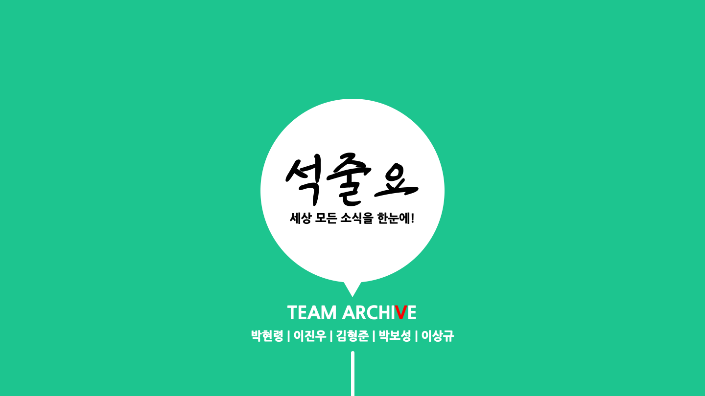
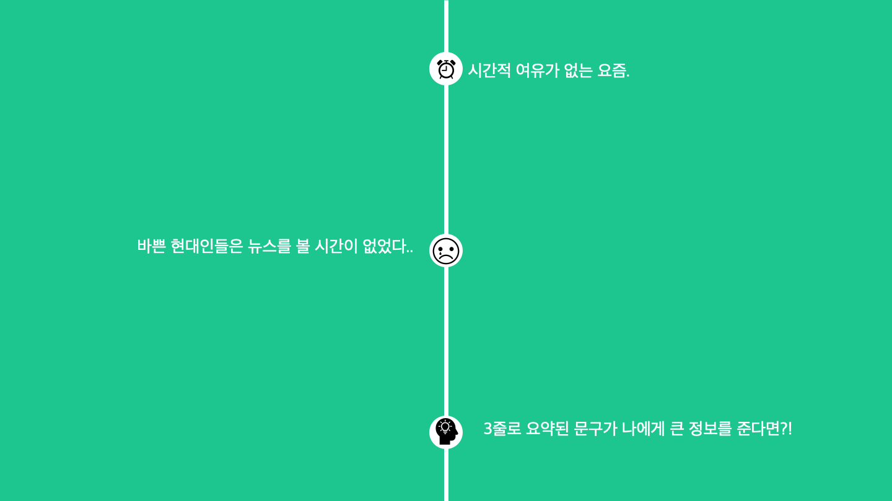
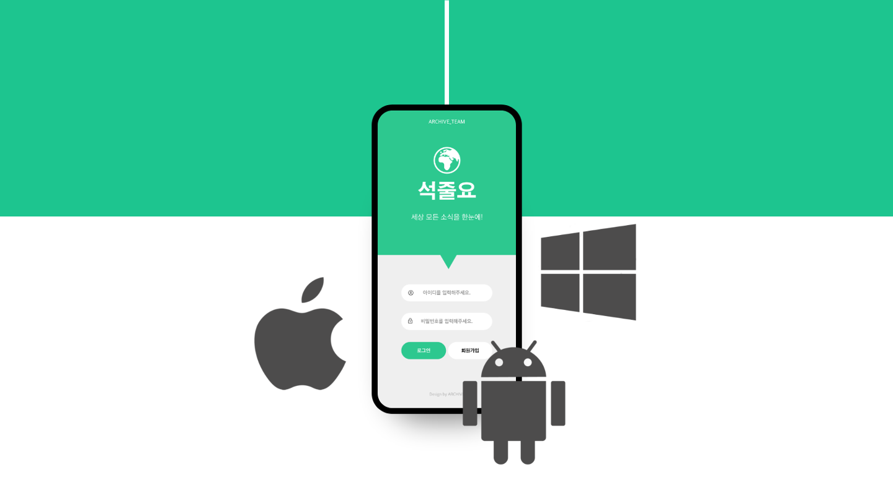
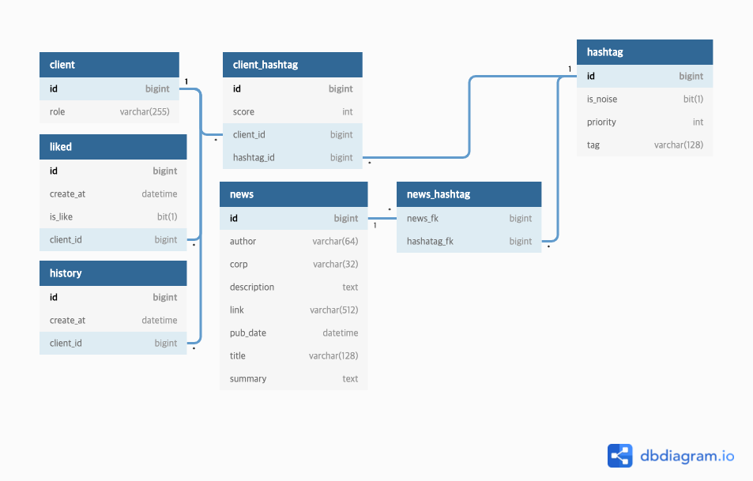

	
	
	

  

# Introduce

<h3>오늘의 소식을 3줄로 소식을 쉽고 빠르게!</h3>
<pre>
 최근 1분만, 1분미만 등.. 바쁜 현대인들을 위해 짧은 시간 안에 유익한 정보를 설명해주는 유튜브 채널이 늘고 있습니다. 이처럼 10~15분 채 안 되는 영상매체도 꺼리는 사람에겐 긴 글로 이루어진 뉴스는 쥐약일 것입니다. 긴 글로 이루어진 뉴스를 짧게 3줄로 짧게 요약하여 오늘의 소식을 간단하게 전달한다면 좀 더 많은 사람이 세상 소식에 대해 귀 기울일 수 있지 않을까 하여 프로젝트를 진행하게 되었습니다.
</pre>

 

# Database ERD

	

